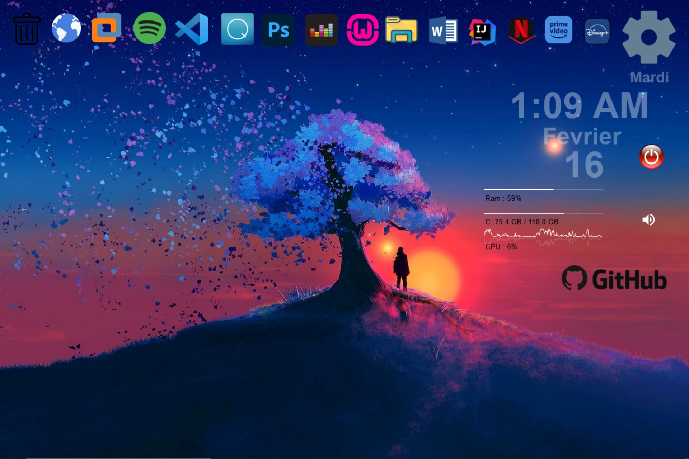

# RainMeter-Themes

Here is a RainMeter theme that I coded and set up for me and with what I want for my personal comfort and ease of access

 </img>

  - install [rainmeter](https://www.rainmeter.net/) & And clone my my project or download it 
  - Launch Mon Thème_V1.1.rmskin
  - And maybe you have to custom something like Repo Access // Software Access
  - AND ENJOY IT 
  
 ### Make With Love ♡
